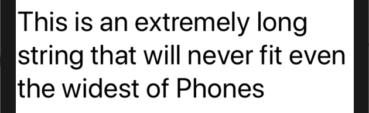
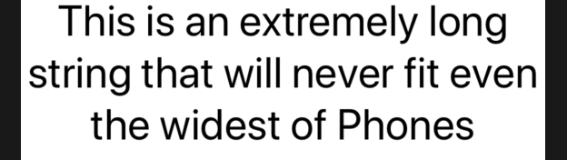
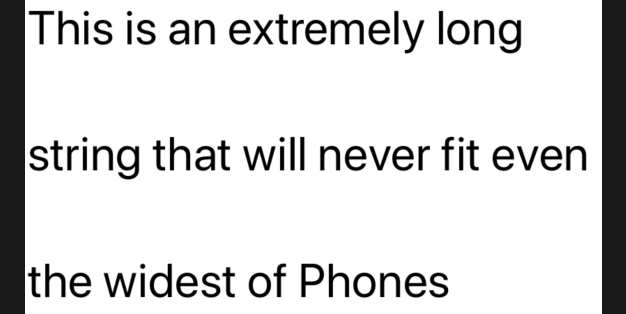

# 1.3 如何使用字体、颜色、行距等设置文本视图的样式

## [How to style text views with fonts, colors, line spacing, and more](https://www.hackingwithswift.com/quick-start/swiftui/how-to-style-text-views-with-fonts-colors-line-spacing-and-more)

文本视图不仅在外观方面给了我们一个可预见的广泛控制，而且还设计成与苹果的核心技术（如 `Dynamic Type`）无缝配合。

#### 1. 字体

默认情况下，文本视图有一个 `Body` 动态类型样式，但是我们可以通过以下方式调用 `.font()`，从其它 _sizes_ 和 _weights_ 进行选择:

```swift
Text("This is an extremely long string that will never fit even the widest of Phones")
    .lineLimit(nil)
    .font(.largeTitle)
```

运行效果: 



我们现在在文本视图下面使用了两个修饰符，这没关系 - 你可以将它们堆叠起来，并且它们都会生效。

#### 2. 文本对齐

特别是，现在我们有多行文本，我们需要调整文本的对齐方式，使其居中，如下所示:

```swift
Text("This is an extremely long string that will never fit even the widest of Phones")
    .lineLimit(nil)
    .font(.largeTitle)
    .multilineTextAlignment(.center)
```

运行效果: 



#### 3. 字体颜色

我们可以通过 `.foregroundColor()` 修饰符来设置文本颜色，如下所示:

```swift
Text("The best laid plans")
    .foregroundColor(Color.red)
```

运行效果: 


#### 4. 背景

我们可以使用 `.background()` 来设置背景颜色，但是它不仅仅可以用来设置背景颜色，也可以设置背景视图。无论如何，为了给我们的文本视图设置一个黄色背景，代码如下:

```swift
Text("The best laid plans")
    .foregroundColor(Color.red)
    .background(Color.yellow)
```

运行效果:


#### 5. 行间距

我们可以设置多行文本的行间距，行间距默认值为0，表示没有额外的行间距，但是我们可以通过以下方式在行与行之间指定一个值来添加额外的行间距。

```swift
Text("This is an extremely long string that will never fit even the widest of Phones")
    .lineLimit(nil)
    .font(.largeTitle)
    .lineSpacing(50)
```

运行效果: 




