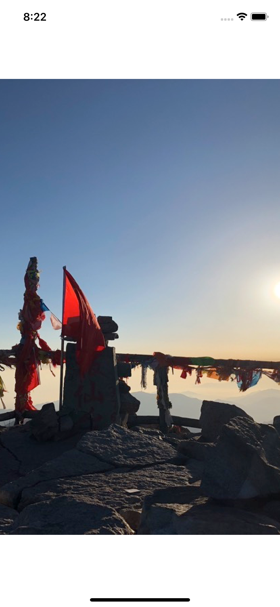
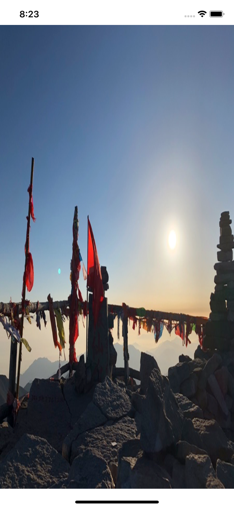

# 1.6 如何调整图像填充其空间的方式

## [How to adjust the way an image is fitted to its space](https://www.hackingwithswift.com/quick-start/swiftui/how-to-adjust-the-way-an-image-is-fitted-to-its-space)


## 如何调整图像适合其空间的方式

SwiftUI 的图像视图（`Image` view）能够以不同的方式进行缩放，就像 `UIImageView` 的 **`content mode`** 一样。

默认情况下，图像视图会自动调整其内容的大小，这可能会使它们超出屏幕。

```swift
Image("example-image")
```



如果添加了 `resizable()` 修饰符，则图像将自动调整大小，以填充所有可用空间: 

```swift
Image("example-image")
    .resizable()
```

然而，这也可能导致图像的原始纵横比失真，因为它将在所有维度上被拉伸任意数量，以使其填充空间。



如果要保持其纵横比，应使用`.fill`或`.fit`添加一个`aspect ratio`修饰符，如下所示：

```swift
Image("example-image")
    .resizable()
    .aspectRatio(contentMode: .fill)
```


**注意:** 在当前的测试版中，有一个bug，`.fit`内容模式仍然会导致图像被拉伸。

