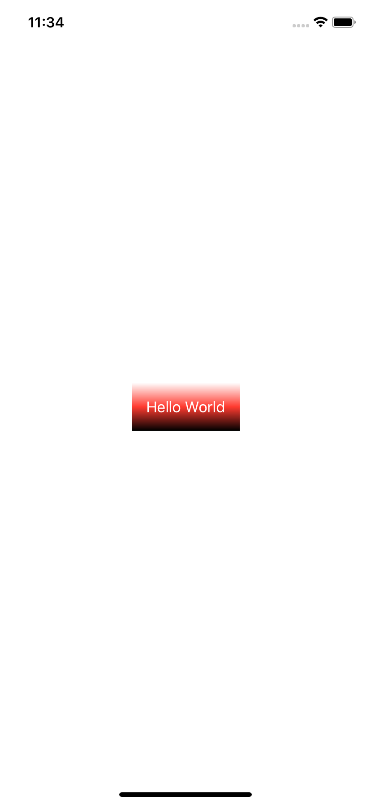
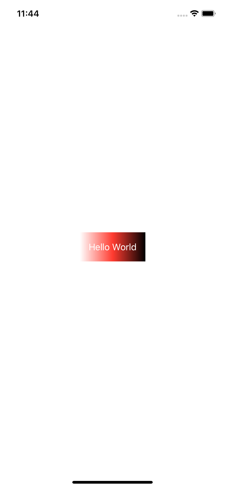
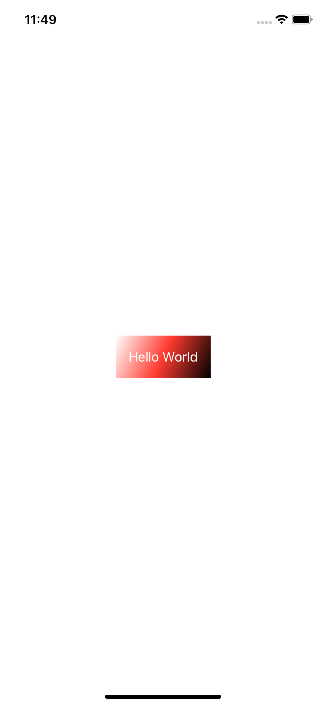

# 1.7 如何渲染渐变

## [How to render a gradient](https://www.hackingwithswift.com/quick-start/swiftui/how-to-render-a-gradient)

**SwiftUI** 为我们提供了各种渐变选项（**gradient options**），所有这些选项都可以以各种方式来使用。例如: 

## 1.垂直线性渐变

可以使用从白色到黑色的线性渐变来渲染文本视图\(**Text** view\)，如下所示: 

```swift
var body: some View {
    Text("Hello World")
        .padding()
        .foregroundColor(.white)
        .background(LinearGradient(gradient: Gradient(colors: [.white, .black]), startPoint: .top, endPoint: .bottom), cornerRadius: 0)
}
```


颜色被指定为一个数组，你可以拥有任意多你想要的颜色 - 默认情况下，SwiftUI 将会平均分配这些颜色。所以，我们可以这样从 **白色 -&gt; 红色 -&gt; 黑色**:

```swift
var body: some View {
    Text("Hello World")
        .padding()
        .foregroundColor(.white)
        .background(LinearGradient(gradient: Gradient(colors: [.white, .red, .black]), startPoint: .top, endPoint: .bottom), cornerRadius: 0)
}
```



## 2.水平线性渐变

要实现一个水平渐变（a horizontal gradient）而不是一个垂直渐变（a vertical one），使用 `.leading` 和 `.trailing` 来作为 **`startPoint`** 和 **`endPoint`**：

```swift
var body: some View {
    Text("Hello World")
       .padding()
       .foregroundColor(.white)
       .background(LinearGradient(gradient: Gradient(colors: [.white, .red, .black]), startPoint: .leading, endPoint: .trailing), cornerRadius: 0)
}
```



## 3.对角线线性渐变

要实现对角线渐变，可以使用 `.topLeading` 和 `.bottomTrailing` 作为 **`startPoint`** 和 **`endPoint`**：

```swift
var body: some View {
    Text("Hello World")
        .padding()
        .foregroundColor(.white)
        .background(LinearGradient(gradient: Gradient(colors: [.white, .red, .black]), startPoint: .topLeading, endPoint: .bottomTrailing), cornerRadius: 0)
}
```




