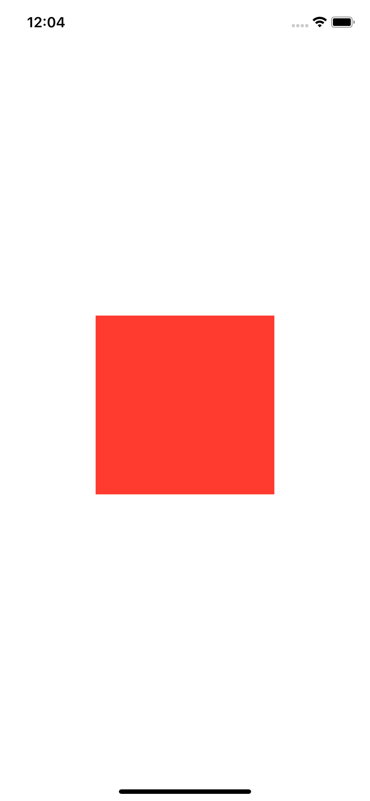
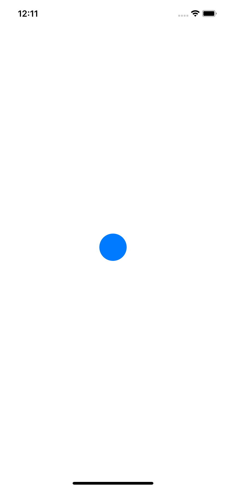

# 1.8 如何显示实体形状

## [How to display solid shapes](https://www.hackingwithswift.com/quick-start/swiftui/how-to-display-solid-shapes)

如果你想在你的应用程序中使用简单地形状，你可以直接创建它们，然后根据需要对它们进行着色和定位。

## 1. 矩形

例如，如果你想要一个 `200x200`红色矩形，您可以使用如下代码:

```swift
var body: some View {
    Rectangle()
        .fill(Color.red)
        .frame(width: 200, height: 200)
}
```



## 2.圆

同样，如果你想要一个 `50x50` 的蓝色圆圈，您可以使用如下代码:

```swift
var body: some View {
    Circle()
        .fill(Color.blue)
        .frame(width: 50, height: 50)
}
```




