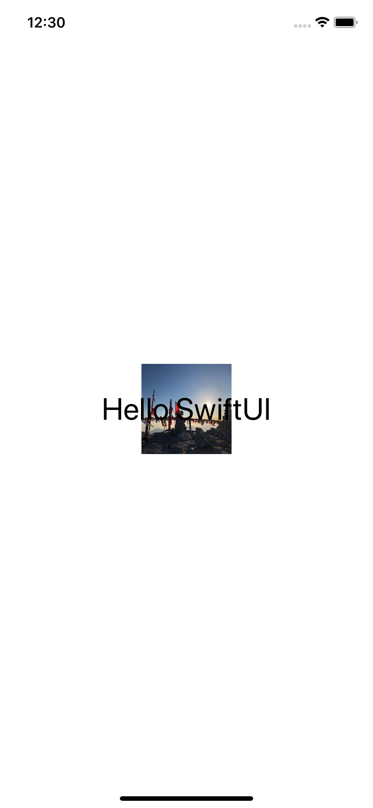
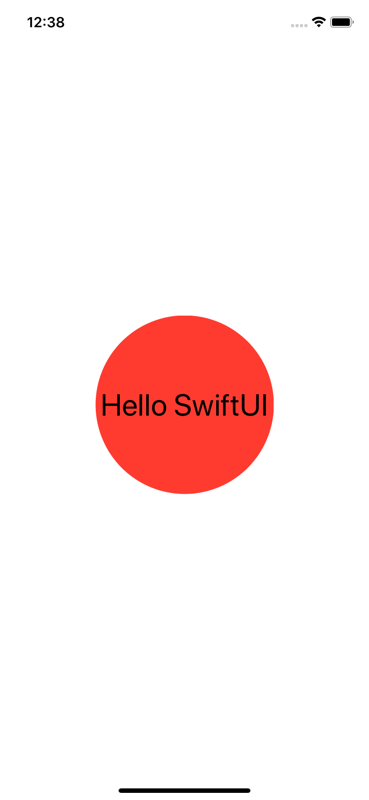

# 1.9 如何使用图像和其它视图作为背景

## [How to use images and other views as a backgrounds](https://www.hackingwithswift.com/quick-start/swiftui/how-to-use-images-and-other-views-as-a-backgrounds)

你可以使用相同的 `background()` 修饰语（modifier ）来指定背景图像，而不是制定背景颜色。

## 1. 给文本视图设置图像背景

例如: 现在，我们要创建一个大字体的文本视图，然后在其后面放置一个 100x100 的图像:

```swift
var body: some View {
        Text("Hello SwiftUI")
            .font(.largeTitle)
            .background(
                Image("example-image")
                    .resizable()
                    .frame(width: 100, height: 100)
            )
    }
}
```



## 2.给文本视图设置一个红色圆圈作为背景

然而，在 SwiftUI 中，背景 View 并不一定是一个图像，您实际上可以使用任何类型的视图作为背景。例如: 现在将创建相同的文本视图，然后在其后面放置一个 200x200 的红色圆圈: 

```swift
var body: some View {
    // 红色圆圈作背景
    Text("Hello SwiftUI")
        .font(.largeTitle)
        .background(
            Circle()
                .fill(Color.red)
                .frame(width: 200, height: 200)
        )
}
```



默认情况下，背景视图会自动占用尽可能多的空间以完全可见，但如果需要，可以使用 `clipped()` 修饰符将其剪裁为父视图的大小：

```swift
var body: some View {
    // 红色圆圈作背景
    Text("Hello SwiftUI")
        .font(.largeTitle)
        .background(
            Circle()
                .fill(Color.red)
                .frame(width: 200, height: 200)
                .clipped()
        )
}
```

为了清楚起见，您可以使用任何视图作为背景，例如，如果需要，可以使用另一个文本视图。


