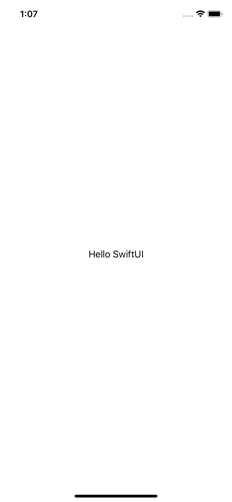
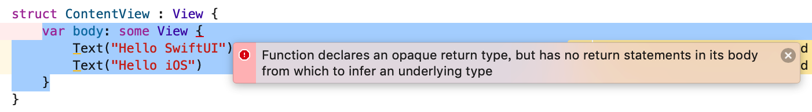
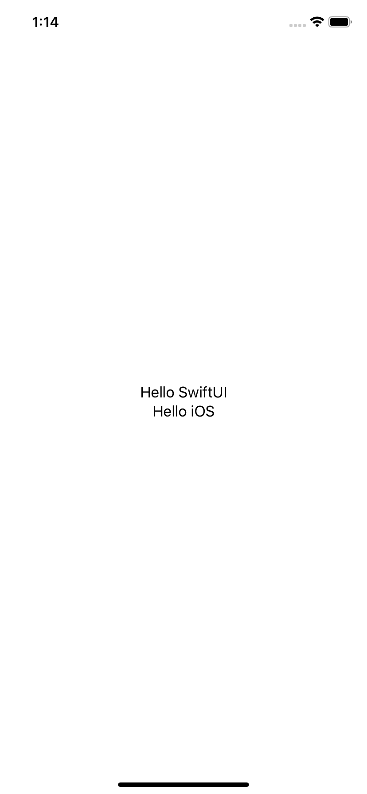
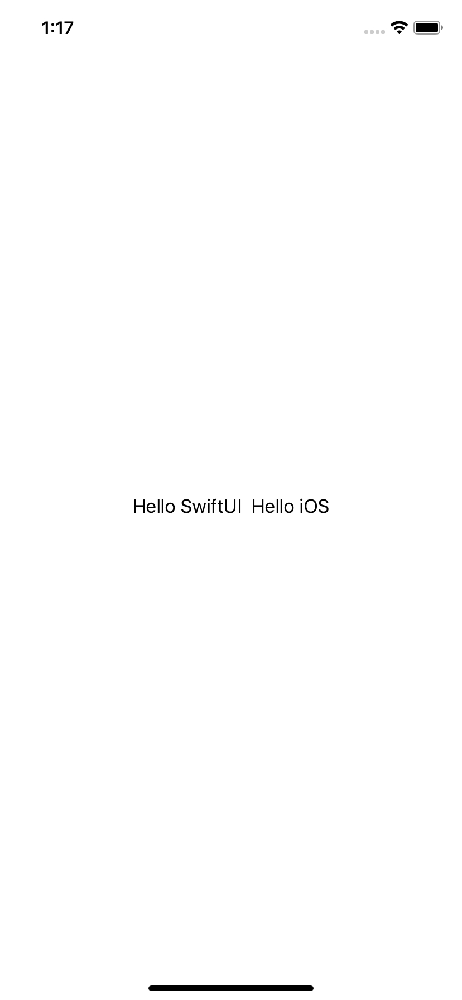

# 2.1 如何使用 VStack和 HStack 创建堆栈

## [How to create stacks using VStack and HStack](https://www.hackingwithswift.com/quick-start/swiftui/how-to-create-stacks-using-vstack-and-hstack)

SwiftUI 的内容视图（content views）必须返回一个视图，即我们希望它们显示的视图。当我们一次想要在屏幕上显示多个视图时，我们需要告诉 SwiftUI 如何排列它们，这就是**`堆栈（stacks）`**的来源。

**堆栈（Stacks） （**相当于 UIKit 中的 UIStackView）有三种形式: `水平（HStack）`、`垂直（VStack）`和 `基于深度（ZStack）`，当你想放置子视图以便它们重叠时可以使用后者。

## 1. VStack

让我们从一些简单地事情开始，这里有一个文本视图:

```swift
var body: some View {
    Text("Hello SwiftUI")
}
```



如果我们想在下面再写一个，我们不能只写:

```swift
var body: some View {
    Text("Hello SwiftUI")
    Text("Hello iOS")
}
```

记住，我们只需要返回一个视图，否则代码就不会工作。



相反，我们需要将其放置在`垂直堆栈（VStack）`中，以便将文本视图放置在彼此上方:

```swift
var body: some View {
    VStack {
       Text("Hello SwiftUI")
       Text("Hello iOS")            
    }
}
```



您会注意到垂直堆栈（VStack）放置在屏幕的中心，标签也居中，它们之间有一些自动空间。

## 2. HStack

如果您希望标签并排水平放置，请使用如下方式将 `VStack` 替换为 `HStack`:

```swift
var body: some View {
    HStack {
       Text("Hello SwiftUI")
       Text("Hello iOS")            
    }
}
```




