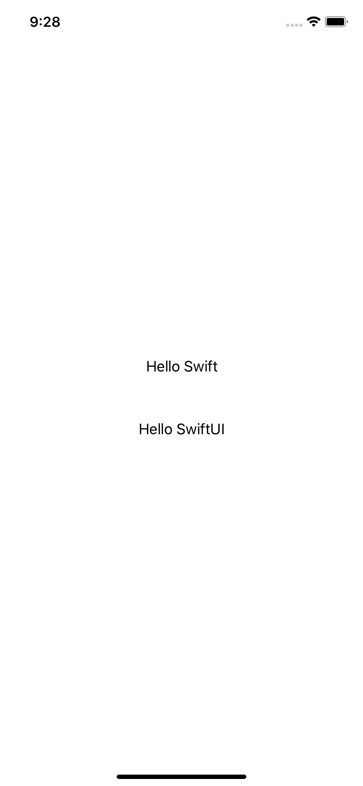
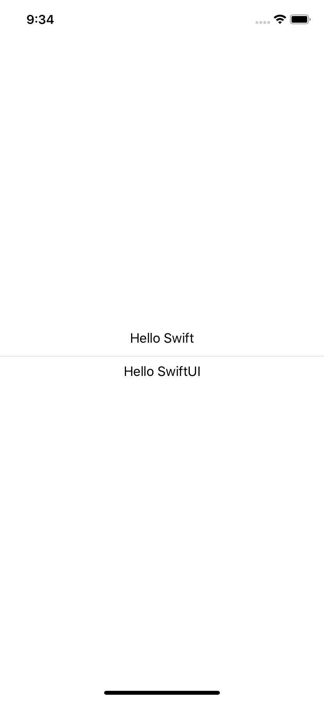
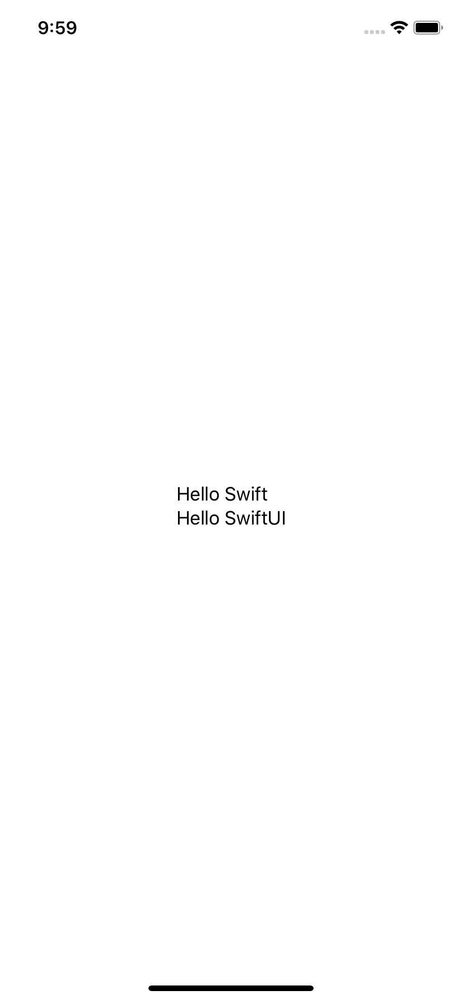
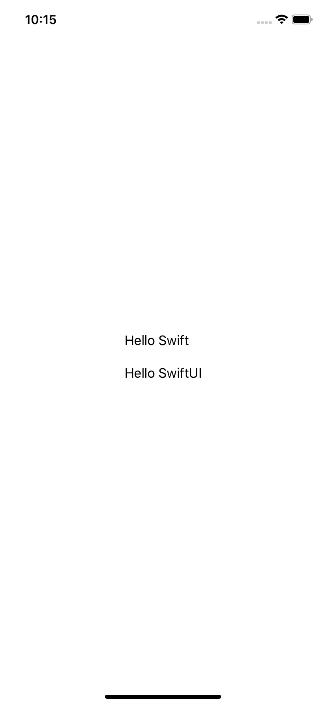

# 2.2 如何通过 alignment 和 spacing 自定义堆栈布局

## [How to customize stack layouts with alignment and spacing](https://www.hackingwithswift.com/quick-start/swiftui/how-to-customize-stack-layouts-with-alignment-and-spacing)

## 1. spacing

您可以通过在 SwiftUI **`stacks`** ``的初始化程序中提供值来添加间距，如下所示:

```swift
var body: some View {
    VStack(spacing: 50) {
        Text("Hello Swift")
        Text("Hello SwiftUI")
    }
}
```



## 2. Divider

或者，你可以在项目（items）之间创建分隔符（dividers），以便 SwiftUI 在堆栈（stack）中的每个项目（item）之间进行小的视觉区分，如下所示:

```swift
var body: some View {

    VStack {
        Text("Hello Swift")
        Divider()
        Text("Hello SwiftUI")
    }
}
```



## 3. alignment

默认情况下，堆栈（stacks）中的项目（items）居中对齐。  
在 **HStack**  中，意味着项目（items）在中间是垂直对齐的，因此如果有两个不同高度的文本视图，它们都将与它们的垂直中心对齐。  
在 **VStack** 中，意味着项目（items）在中间水平对齐，因此如果有两个长度不同的文本视图，它们都将与水平中心对齐。

要调整这种情况，请在创建堆栈时按以下方式传递一个 `alignment` 参数:

```swift
var body: some View {
    VStack(alignment: .leading) {
        Text("Hello Swift")
        Text("Hello SwiftUI")
    }
}
```



这将使 `“Hello Swift”` 和 `“Hello SwiftUI”` 左对齐，但它们最终将位于屏幕的中间，因为堆栈只占用所需的空间。

## 4.同时使用 alignment 和 spacing

当然，可以同时使用 `alignment` 和 `spacing`，如下所示:

```swift
var body: some View {
    VStack(alignment: .leading, spacing: 20) {
        Text("Hello Swift")
        Text("Hello SwiftUI")
    }
}
```



这将使两个文本视图水平对齐到前缘（leading）（对于从左到右的语言是左对齐），并在它们之间放置20个点的垂直空间。


