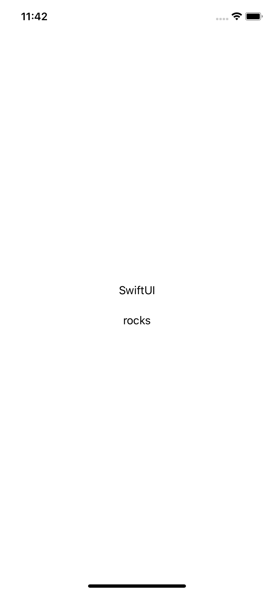
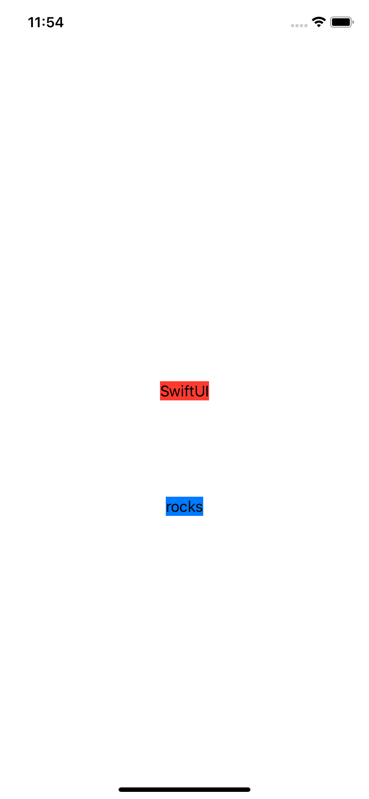

# 2.3 如何使用 padding 来控制单个视图周围的间距

## [How to control spacing around individual views using padding](https://www.hackingwithswift.com/quick-start/swiftui/how-to-control-spacing-around-individual-views-using-padding)

SwiftUI 允许我们使用 `padding()` 修饰符（modifier）在视图周围设置单独的填充（padding）。

## 1.系统默认 padding

如果在没有参数的情况下使用此选项，您将在所有边上获得系统默认填充，如下所示:

```swift
var body: some View {
    VStack {
        Text("SwiftUI")
            .padding()
        Text("rocks")
    }
}
```



## 2.只设置一侧系统默认 padding

但您也可以自定义要 apply 的填充量（padding）和位置。因此，您可能只希望将系统填充应用于一侧:

```swift
 var body: some View {
    VStack {
        Text("SwiftUI")
            .background(Color.red)
            .padding(.bottom)
        Text("rocks")
            .background(Color.blue)
    }
}
```

## 3.用具体数值来设置 padding

或者，您可能希望控制对所有边应用了多少padding：

```swift
var body: some View {
    VStack {
        Text("SwiftUI")
            .background(Color.red)
            .padding(100)
        Text("rocks")
            .background(Color.blue)
    }
}
```



## 4. 在视图一侧添加特定数量的填充

或者，您也可以将这两者结合起来，在视图的一侧添加特定数量的填充：

```swift
Text("SwiftUI")
    .padding(.bottom, 100)
```


