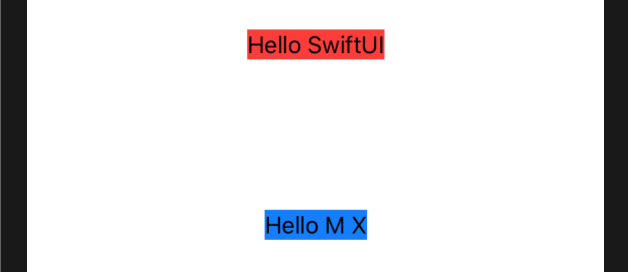

# 2.3 如何使用 padding 来控制单个视图周围的间距

## [How to control spacing around individual views using padding](https://www.hackingwithswift.com/quick-start/swiftui/how-to-control-spacing-around-individual-views-using-padding)

SwiftUI 允许我们使用 `padding()` 修饰符在视图周围设置单独的填充。

#### 1. 系统默认 padding

如果在不传参数的情况下使用 _padding\(\)_ ，您将在所有边上获得系统默认填充，如下所示:

```swift
var body: some View {
    VStack {
        Text("Hello SwiftUI")
            .background(Color.red)
            .padding()
        Text("Hello M X")
            .background(Color.blue)
    }
}
```

运行效果: 


注意: 这里默认设置了视图四周的填充。

#### 2. 只设置一侧系统默认 padding

我们也可以自定义要 apply 的 _padding_ 和位置。因此，我们只希望将系统填充应用于一侧:

```swift
var body: some View {
    VStack {
        Text("Hello SwiftUI")
            .background(Color.red)
            .padding(.bottom)
        Text("Hello M X")
            .background(Color.blue)
    }
}
```

运行效果: 


 注意: 这里只设置了底部填充，与上面的例子不同。

#### 3. 用具体数值来设置 padding

我们可能希望控制对所有边应用了多少填充:

```swift
var body: some View {
    VStack {
        Text("Hello SwiftUI")
            .background(Color.red)
            .padding(100)
        Text("Hello M X")
            .background(Color.blue)
    }
}
```

运行效果:



#### 4. 在视图一侧添加特定数量的填充

我们也可以将这两者结合起来，在视图的一侧添加特定数量的填充：

```swift
var body: some View {
  VStack {
      Text("Hello SwiftUI")
          .background(Color.red)
          .padding(.bottom, 100)
      Text("Hello M X")
          .background(Color.blue)
  }
}
```

运行效果: 


