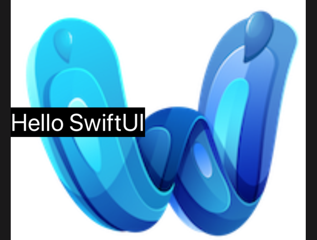

# 2.4 如何使用ZStack将视图分层

## [How to layer views on top of each other using ZStack](https://www.hackingwithswift.com/quick-start/swiftui/how-to-layer-views-on-top-of-each-other-using-zstack)

SwiftUI 有一个专用的 _stack_ 类型，用于创建重叠内容，例如，如果我们想在图片上放置一些文本，它就很有用。它被称为 `ZStack`，其工作原理与其他两种 _stack_ 类型相同。

#### 1. 在文本下面放置图片

例如: 我们可以在如下文本下面放置一个大图像:

```swift
var body: some View {
    ZStack() {
        Image("example-image")
        Text("Hello SwiftUI")
            .font(.largeTitle)
            .background(Color.black)
            .foregroundColor(.white)
    }
}
```

运行效果: 


#### 2. 对齐

与其它 _stack_ 类型一样，`ZStack` 也可以设置对齐方式，这样它就不会总是将事物置于自身的中心位置:

```swift
var body: some View {
    ZStack(alignment: .leading) {
        Image("example-image")
            .resizable()
            .aspectRatio(contentMode: .fit)
        Text("Hello SwiftUI")
            .font(.largeTitle)
            .background(Color.black)
            .foregroundColor(.white)
    }
}
```

运行效果:



但是，它没有 _spacing_ 属性，因为它实际上没有意义。


