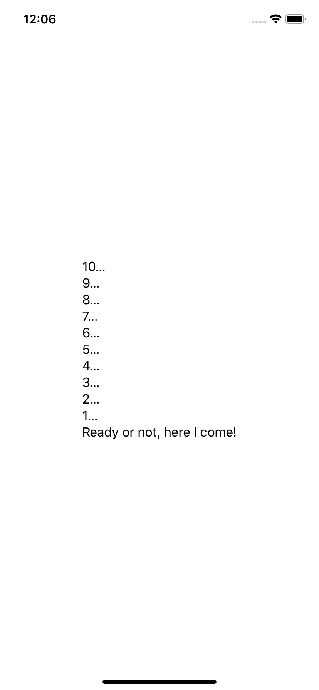

# 2.6 如何使用 ForEach 在循环中创建视图

## [How to create views in a loop using ForEach](https://www.hackingwithswift.com/quick-start/swiftui/how-to-create-views-in-a-loop-using-foreach)

您通常会发现您想要循环一个序列来创建视图，而在 SwiftUI 中，这是使用 **`ForEach`** 完成的。

**重要提示**: 很容易看到 `ForEach` 并认为它与 Swift 序列中的 **`forEach()`** 方法相同，但事实并非如你所见。

SwiftUI 中的 `ForEach` 本身就是一个视图结构，这意味着您可以根据需要直接从视图 **Body** 返回它。您为它提供了一系列项目，你可能还需要告诉 SwiftUI 它如何唯一地标识您的每个项目，以便它知道如何在值更改时更新它们。您还传递一个要运行的闭包，来为循环中的每个项创建一个视图。

对于范围内的简单循环，您可以将范围直接传递给ForEach。 例如，这从10减少到1然后在最后添加一条消息：

```swift
var body: some View {
    VStack(alignment: .leading) {
        ForEach((1...10).reversed()) {
            Text("\($0)…")
        }
            
        Text("Ready or not, here I come!")
    }
}
```



对于简单类型数组（如字符串、整数、颜色等）的循环，可以在数组上使用 `.identified(by: \.self)`    ，让 SwiftUI  使用值本身作为标识符。因此，如果您的数组是 \["`cat`", "`Dog`", "`monkey`" \]，那么 SwiftUI 会将这些字符串本身作为您的视图的标识符。

因此，此代码创建一个包含三种颜色的数组，在它们上面循环，并使用每个颜色名称和颜色值创建文本视图：

```swift
let colors: [Color] = [.red, .green, .blue]
    
var body: some View {
        
    VStack {
        ForEach(colors.identified(by: \.self)) { color in
            Text(color.description.capitalized)
                .padding()
                .background(color)
        }
    }
}
```

如果您的数组中有自定义类型，则应使用  `.identified(by:)`与您的类型中的任何属性唯一标识它。  
例如，这是一个存储测试结果的结构，如下所示：

```swift
struct Result {
    var id = UUID()
    var score: Int
}
```

它有一个带有UUID的id属性，这意味着它保证是唯一的 - 完美的用于我们的目的。 如果我们想循环一个结果数组，创建一个显示VStack中每个结果的文本视图，那么我们将使用它：

```swift
let results = [Result(score: 8), Result(score: 5), Result(score: 10)]
    
var body: some View {
    VStack {
        ForEach(results.identified(by: \.id)) { result in
            Text("Result: \(result.score)")
        }
    }
}
```


这告诉SwiftUI它可以通过查看它们的id属性来区分ForEach中的视图。

**提示**：如果您使Result符合Identifiable protocol，您只需编写ForEach（结果）。 符合此协议意味着添加唯一标识每个对象的id属性，在我们的示例中我们已经拥有，因此您只需编写 `struct Result：Identifiable {`！


