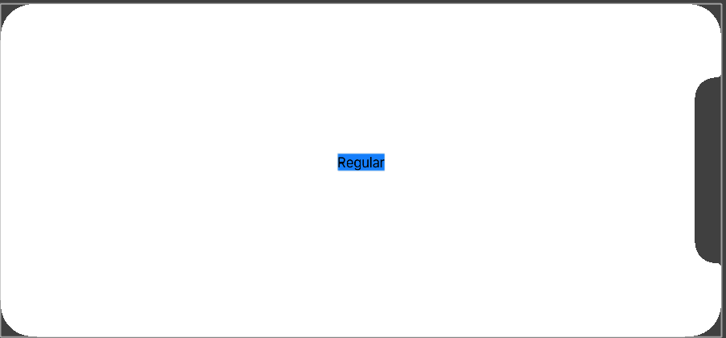

# 2.7 如何使用 size classes 创建不同的布局

## [How to create different layouts using size classes](https://www.hackingwithswift.com/quick-start/swiftui/how-to-create-different-layouts-using-size-classes)

SwiftUI 通过在环境中暴露 _size classes_ 来原生支持它。如果要使用它，我们首先需要创建一个 `@Environment` 对象来存储其值，如下所示:

```swift
@Environment(\.horizontalSizeClass) var horizontalSizeClass: UserInterfaceSizeClass?
```

然后在我们需要时检查该属性的值，查找 `.compact` 或 `.regular`，如下所示:

```swift
if horizontalSizeClass == .compact {
    return Text("Compact")
} else {
    return Text("Regular")
}
```

将所有代码组合在一起，可以创建这样的视图:

```swift
struct ContentView: View {

    @Environment(\.horizontalSizeClass) var horizontalSizeClass: UserInterfaceSizeClass?

    var body: some View {
        if horizontalSizeClass == .compact {
            return Text("Compact")
        } else {
            return Text("Regular")
        }
    }
}
```

运行效果:

\(1\) 正向竖屏 


 \(2\) 横屏 - 刘海在右侧 



 \(3\) 横屏 - 刘海在左侧 


