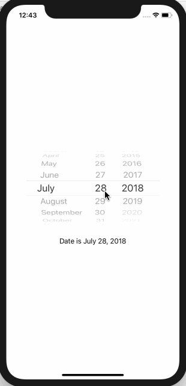

# 3.10 如何创建日期选择器（DatePicker）并从中读取值

## [How to create a date picker and read values from it](https://www.hackingwithswift.com/quick-start/swiftui/how-to-create-a-date-picker-and-read-values-from-it)

1. 初识

SwiftUI 中的 `DatePicker` 视图类似于 UIkit 中的 `UIDatePicker`，它提供了各种选项来控制它的外观和工作方式。和所有存储值的控件一样，它也需要绑定到应用程序中的某种状态。

#### 2. 示例

例如: 我们创建一个绑定到 `birthDate` 属性的日期选择器，然后显示日期选择器的值，如下所示:

```swift
struct ContentView : View {

    var dateFormatter: DateFormatter {
        let formatter = DateFormatter()
        formatter.dateStyle = .long
        return formatter
    }

    @State var birthDate = Date()

    var body: some View {
        VStack {
            DatePicker($birthDate,
                       maximumDate: Date(),
                       displayedComponents: .date)
            Text("Date is \(birthDate, formatter: dateFormatter)")
        }
    }
}
```

运行效果: 



 可以看到我已经将 **DisplayedComponents** 设置为 .Date，但您也可以使用 `.hourAndMinute`来获取时间数据。 我还使用 _maximumDate_ 来阻止人们在将来指定出生日期，但是您可以指定 _minimumDate_ 来阻止人们指定早于您选择的日期。 

