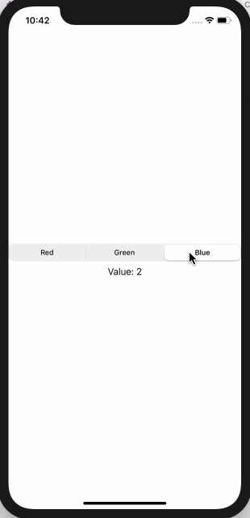

# 3.11 如何创建 segmented control 并从中读取值

## [How to create a segmented control and read values from it](https://www.hackingwithswift.com/quick-start/swiftui/how-to-create-a-segmented-control-and-read-values-from-it)

#### 1. 初识

SwiftUI中 的 `SegmentedControl` 与 UIKit中的 `UISegmentedControl` 的工作方式类似，但是它需要绑定到某种状态（state），并且必须确保为每个分段（segment）提供一个 tag 标记，以便能够识别它。**分段\(Segments\) 可以是文本或者图片，其它任何东西都会自动失败**。

#### 2. 示例

我们将创建一个分段控件，该控件使用 `favoriteColor` 作为状态属性，并且在下面添加一个文本视图，用于显示所选的任何值:

```swift
struct ContentView : View {

    @State private var favoriteColor = 0

    var body: some View {
        VStack {
            SegmentedControl(selection: $favoriteColor) {
                Text("Red").tag(0)
                Text("Green").tag(1)
                Text("Blue").tag(2)
            }
            Text("Value: \(favoriteColor)")
        }
    }
}
```

运行效果: 



不过，在本例中，我们最好创建一个数组来存储各种颜色，然后使用 _foreach_ 在内部使用循环创建文本视图:

```swift
struct ContentView : View {

    @State private var favoriteColor = 0

    var colors = ["Red", "Green", "Blue"]

    var body: some View {
        VStack {
            SegmentedControl(selection: $favoriteColor) {
                ForEach(0..<colors.count) { index in
                    Text(self.colors[index]).tag(index)
                }
            }
            Text("Value: \(colors[favoriteColor])")
        }
    }
}
```

运行效果: 


