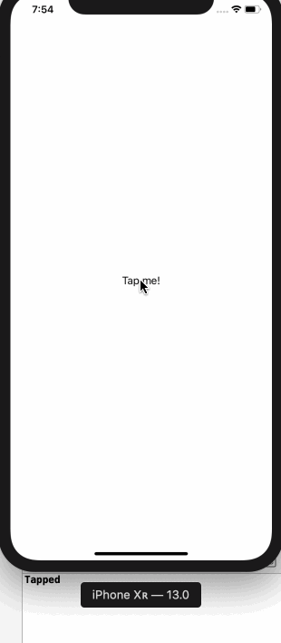
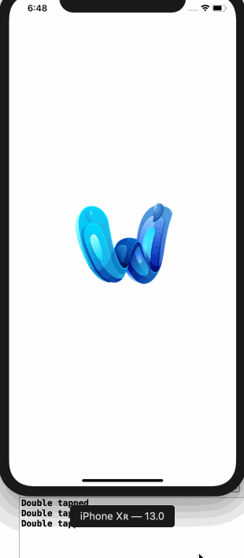

# 3.12 如何阅读轻击和双击手势

## [How to read tap and double-tap gestures](https://www.hackingwithswift.com/quick-start/swiftui/how-to-read-tap-and-double-tap-gestures)

#### 1. 初识

任何 SwiftUI 视图都可以附加 `点击操作(tap action)`，我们可以指定在触发操作之前应该接收多少次点击。

#### 2. 示例

例如: 我们创建一个文本视图，在点击时将打印消息:

```swift
struct ContentView : View {
    var body: some View {
        Text("Tap me!")
            .tapAction {
                print("Tapped")
            }
    }
}
```

运行效果: 



再创建一个图像视图，当双击时将打印消息: 

```swift
struct ContentView : View {
    var body: some View {
        Image("example-img")
            .tapAction(count: 2) {
            print("Double tapped!")
    }
}
```

运行效果: 



