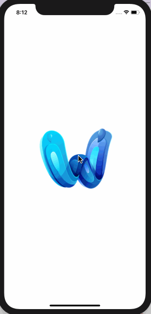
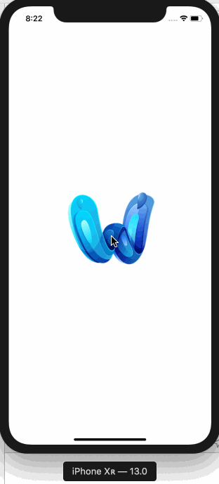
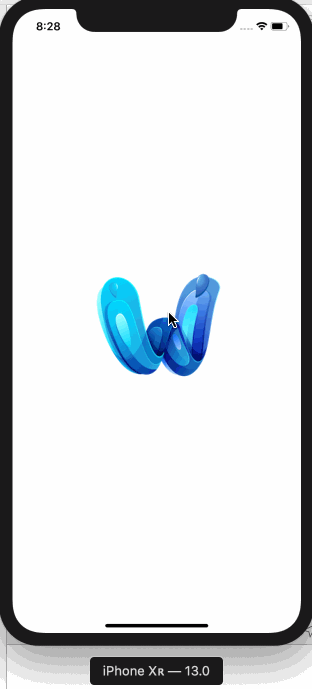

# 3.13 如何给视图添加手势识别器

## [How to add a gesture recognizer to a view](https://www.hackingwithswift.com/quick-start/swiftui/how-to-add-a-gesture-recognizer-to-a-view)

#### 1. 简介

任何 SwiftUI 视图都可以附加手势识别器，而这些手势识别器又可以附加闭包，在识别器被激活时执行闭包。

#### 2. 示例

有几个手势识别器可供使用，这里我们提供其中几个的代码示例，以帮助入门 - 我们将看到它们有多相似。

**2.1 TapGesture 点击手势**

创建 TapGesture 时，可以指定触发手势所需的 点击次数，然后附加将在手势发生时运行的 `onEnded` 闭包。

例如，我们来创建一个每次点击时都会变大的图像:

```swift
struct ContentView: View {

    @State private var scale: Length = 1

    var body: some View {
        Image("example-image")
            .scaleEffect(scale)
            .gesture(
                TapGesture()
                    .onEnded({ (_) in
                        self.scale += 0.1
                    })
            )
    }
}
```

运行效果: 



**2.2 LongPressGesture 长按手势**

LongPressGesture 可识别用户何时按下视图并保持至少一段用户指定的时间。 因此，我们创建一个图像视图，在按下该消息至少两秒时打印该消息:

```swift
struct ContentView: View {

    var body: some View {
        Image("example-image")
            .gesture(
                LongPressGesture(minimumDuration: 2.0)
                    .onEnded({ (_) in
                            print("LongPressed!")
                    })
            )
    }
}
```

运行效果：



**2.3 DragGesture 拖拽手势**

最后，当用户按下视图并移动至少一定距离时，DragGesture 会触发。因此，我们创建一个带有拖动手势的图像，当它们移动至少50个点时会触发:

```swift
struct ContentView: View {

    var body: some View {
        Image("example-image")
            .gesture(
                DragGesture(minimumDistance: 50)
                    .onEnded({ (_) in
                        print("Dragged!")
                    })
            )
    }
}
```

运行效果:



