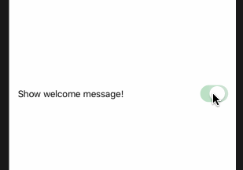

# 3.2 如何创建切换开关（toggle switch）

## [How to create a toggle switch](https://www.hackingwithswift.com/quick-start/swiftui/how-to-create-a-toggle-switch)

SwiftUI 中的 `toggle` 允许用户在 **true** 和 **false** 之间移动，就像 UIKit 中的 `UISwitch` 一样。

例如:

我们可以创建一个 _toggle_ ，然后根据 _toggle_ 是否启动来决定显示或者不显示消息。但是我们不希望手动跟踪 _toggle_ 的状态 -- 我们希望 SwiftUI 为我们做这件事。 与以往不同，在这里，我们应该定义一个 `@State Boolean` 属性，用于存储 toggle 的当前值。然后我们可以使用它来显示或隐藏其它视图。

例如:

```swift
struct ContentView : View {

    @State var showGreeting = true

    var body: some View {
        VStack {
            Toggle(isOn: $showGreeting) {
                Text("Show welcome message!")
            }.padding()

            if showGreeting {
                Text("Hello world")
            }
        }
    }
}
```

运行效果: 



这段代码，只有当 `showGreeting` 为 _true_ 时才会返回文本视图，这意味着当 `showGreeting` 为 _false_ 时，`VStack` 的大小会减小 - 它的堆栈中没有第二个视图。

