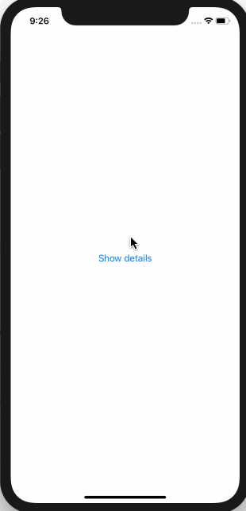
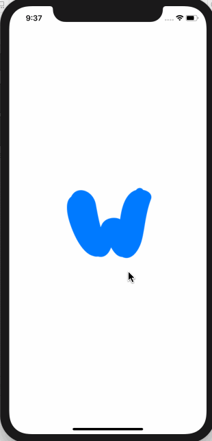

# 3.3 如何创建一个可点击的按钮

## [How to create a tappable button](https://www.hackingwithswift.com/quick-start/swiftui/how-to-create-a-tappable-button)

#### 1. Button vs UIButton

SwiftUI 的 `按钮(Button)` 类似于 UIKit 中的 `UIButton`，跟 UIButton 的区别在于:

* 在显示内容方面 SwiftUI 的按钮更为灵活
* SwiftUI 的按钮使用 `闭包` 来实现其 action，而 UIButton 使用的是 `target/action` 系统

#### 2. Button 初体验

那么，如何创建一个 SwiftUI 的按钮呢?，我们可以从以下代码开始:

```swift
Button(action: {
    // your action here

}) {
    Text("Button title")
}
```

由以上代码可以看到，创建 Button 的的方法有两个参数，都是闭包，第一个闭包负责传入 action，第二个闭包负责传入按钮上的文本。

#### 3. Button 简单用例

例如: 我们可以创建一个按钮，在点击按钮时显示或隐藏一些详细信息:

```swift
struct ContentView : View {

    @State var showDetails = false

    var body: some View {
        VStack {
            Button(action: {
               self.showDetails.toggle()
            }) {
                Text("Show detail information")
            }

            if showDetails {
                Text("You should follow me on M X Website")
                    .font(.largeTitle)
                    .lineLimit(nil)
            }
        }
    }
}
```

运行效果: 



#### 4. 提示

在学习框架时最常做的事情是分散调用 `print()`，这样我们就可以看到什么时候发生了什么事情。 如果我们想通过按钮 action 来尝试，首先应右键单击预览画布中的播放按钮，然后选择 **调试预览**，以便调用 `print()` 工作。 按钮内的标题可以是任何类型的视图，因此您可以创建这样的图像按钮:

```swift
Button(action: {
    self.showDetails.toggle()
}) {
    Image("example-image")
}
```

运行效果: 




