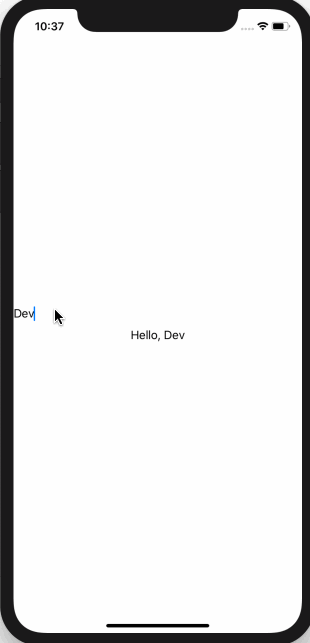

# 3.4 如何从 TextField 中读取文本

## [How to read text from a TextField](https://www.hackingwithswift.com/quick-start/swiftui/how-to-read-text-from-a-textfield)

#### 1. 简介

SwiftUI 的 `TextField` 视图类似于 UIkit 中的 `UITextField`，但是，在默认情况下 `TextField` 看起来有点不同，并且它非常依赖于 **状态绑定（binding to state）**。

#### 2. 创建 TextField

那么，要创建一个 TextField，我们应该给在 _text field_ 传入一个 `placeholder`，再加上它应该绑定到的状态属性。

例如: 现在，我们要创建一个 **绑定到本地字符串的 TextField**，然后在其下面放置一个文本视图，在键入时显示 TextField 的输出:

```swift
struct ContentView : View {

    @State var name = "Devin"

    var body: some View {
        VStack {
            TextField($name, placeholder: Text("Enter your name:"))
            Text("Hello, \(name)")
        }
    }
}
```

运行后，您应该能够在 TextField 中键入内容，并看到下面直接显示一条问候语。 

运行效果: 



提示: 在 beta1 和 beta2 中，应该改用 TextField\($name\)。 使用 TextField 时有两个重要的限制条件。首先，默认情况下，它没有边框，因此你可能看不到任何内容 -- 你需要大致点击其所在位置，以激活键盘。 其次，您可能会发现无法在布局的画布预览中键入内容。如果遇到这个问题，请按Cmd+R在模拟器中构建和运行代码。

