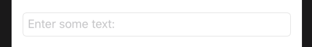

# 3.5 如何给 TextField 添加边框

## [How to add a border to a TextField](https://www.hackingwithswift.com/quick-start/swiftui/how-to-add-a-border-to-a-textfield)

SwiftUI 的 `TextField` 视图默认没有样式，这意味着在屏幕上它是一个空白区域。如果这样就符合你想要的风格，那就太好了，你已经完成了。但是，我们大多时候更愿意在 `TextField` 周围添加边框，以使其更清晰。 如果想获得我们习惯使用的 UITextField 的圆角矩形样式，我们应该使用 `.textFieldStyle(.roundedBorder)` 修饰符，如下所示:

```swift
struct ContentView : View {

    @State var text = ""
    var body: some View {
        TextField($text, placeholder: Text("Enter some text"))
            .padding()
            .textFieldStyle(.roundedBorder)
    }
}
```

运行效果: 




