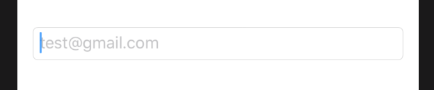

# 3.6 如何给 TextField 添加占位符

## [How to add a placeholder to a TextField](https://www.hackingwithswift.com/quick-start/swiftui/how-to-add-a-placeholder-to-a-textfield)

SwiftUI 的 `TextField` 支持占位符文本，就像 `UITextField` 一样 -- 当 TextField 为空时在 TextField 中显示灰色文本。要么使用提示（”Enter your password“），要么显示一些示例数据。

要设置 placeholder，请将其作为 TextField 初始化设置的一部分传入，如下所示:

```swift
struct ContentView : View {

    @State var emailAddress = ""

    var body: some View {
        TextField($emailAddress, placeholder: Text("test@gmail.com"))
            .textFieldStyle(.roundedBorder)
            .padding()
    }
}
```

运行效果:



这将在 TextField 中显示占位文本 `test@gmail.com`，而 TextField 为空，但一旦用户在其中键入内容，占位文本就会消失。

