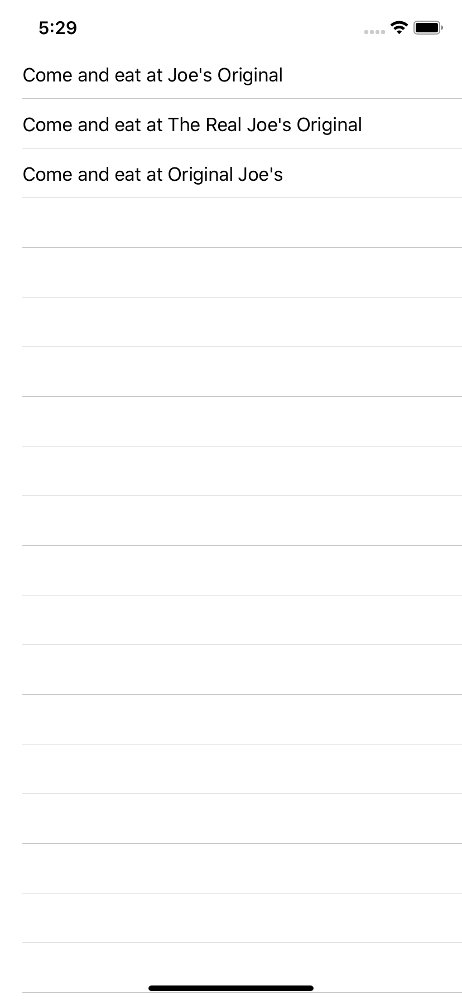

# 5.3 如何创建动态项列表

为了处理动态项目，您必须首先告诉`SwiftUI`如何识别哪个项目是哪个。 这是使用**`Identifiable`**协议完成的，该协议只有一个要求：某种类型的 `id`，`SwiftUI`可以使用它来查看哪个项目是哪个。

例如，您可以创建一个 `Restaurant` 结构体，该结构表示餐馆具有`ID`和`name`，`ID`是一个随机标识符，以便`SwiftUI`知道哪个是哪个：

```swift
struct Restaurant: Identifiable {
    var id = UUID()
    var name: String
}
```

接下来，您将定义列表行的外观。在我们的例子中，我们将定义一个`Restaurantrow`视图，该视图存储一个餐厅并在文本视图中打印其名称：

```swift
struct RestaurantRow : View {
    
    var restaurant: Restaurant
    
    var body: some View {
        Text("Come and eat at \(restaurant.name)")
    }
}
```

最后，我们可以创建一个列表视图来显示所有内容。这意味着创建一些示例数据，将其放入数组中，然后将其传递到要呈现的列表中：

```swift
struct ContentView : View {
    
    var body: some View {
        
        let first = Restaurant(name: "Joe's Original")
        let second = Restaurant(name: "The Real Joe's Original")
        let third = Restaurant(name: "Original Joe's")
        let restaurants = [first, second, third]
        
        return List(restaurants) { restaurant in
            RestaurantRow(restaurant: restaurant)
        }
    }
}
```

其中大部分只是创建数据——最后一部分是实际操作的地方：

```swift
return List(restaurants) { restaurant in
    RestaurantRow(restaurant: restaurant)
}
```

它从`restaurants`数组创建一个列表，对数组中的每个项目执行一次闭包。每次执行闭包时，餐厅的输入都将由数组中的一个项目填充，因此我们使用它来创建一个`Restaurantrow`。

事实上，在这种小case下，我们可以使代码更短:

```swift
return List(restaurants, rowContent: RestaurantRow.init)
```




