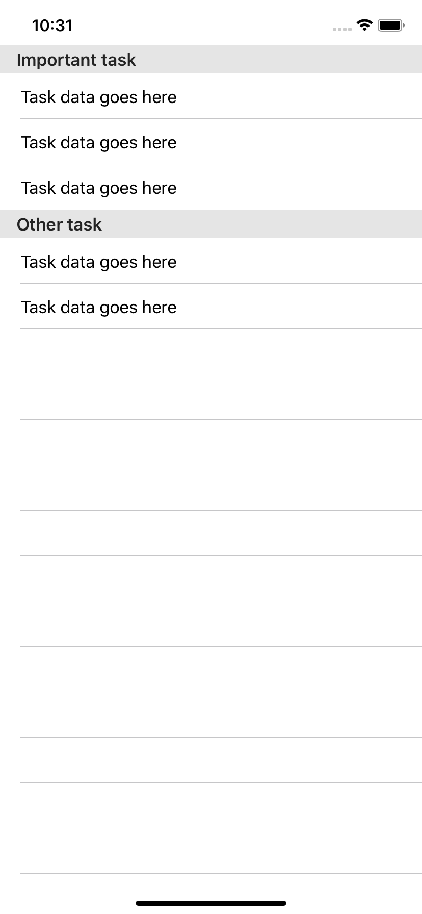
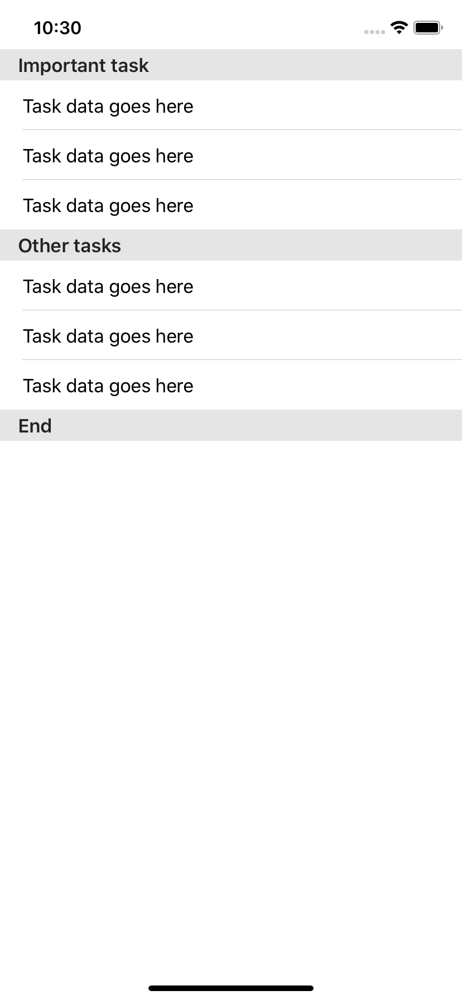

# 5.7 如何向列表中添加 sections

`SwiftUI` 的 `List` 视图内置了对 **`sections`** 和 **`section headers`** 的支持，就像 `UIKit` 中的 `UITableView` 一样。若要给某些 `cells` 添加 `section`，首先在其周围放置一个 `Section`，也可以添加页眉和页脚。

举个例子，这里有一行包含提醒应用的任务数据：

我们要做的是创建一个列表视图，它有两个`Sections`：一个用于重要任务，另一个用于次要任务。这是它的样子：

```swift
struct ContentView : View {
    var body: some View {
        List {
            Section(header: Text("Important task")) {
                TaskRow()
                TaskRow()
                TaskRow()
            }
            Section(header: Text("Other task")) {
                TaskRow()
                TaskRow()
            }
        }
    }
}
```



您还可以向 `Sections` 添加页脚文本，如下所示：

```swift
Section(header: Text("Other tasks"), footer: Text("End")) {
    TaskRow()
    TaskRow()
    TaskRow()
}
```



[How to add sections to a list](https://www.hackingwithswift.com/quick-start/swiftui/how-to-add-sections-to-a-list)

