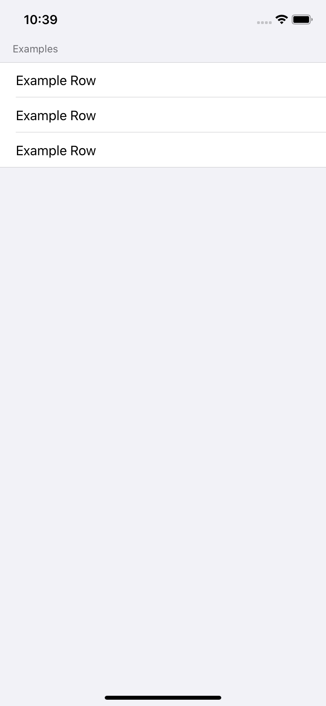

# 5.8 如何制作分组列表\(grouped list\)

`SwiftUI` 的 `List` 支持 **`grouped`** 或 **`plain`** 样式，就像 `UITableView` 一样。默认为 `plain` 样式，但如果要改为 `grouped` 样式，则应使用 列表 的 `.listStyle(.grouped)` 修饰符。

例如，这里定义了一个示例行，并将其放置在分组列表中：

```swift
struct ExampleRow : View {
    var body: some View {
        Text("Example Row")
    }
}

struct ContentView : View {
    var body: some View {
        List {
            Section(header: Text("Examples")) {
                ExampleRow()
                ExampleRow()
                ExampleRow()
            }
        }.listStyle(.grouped)
    }
}
```



[How to make a grouped list](https://www.hackingwithswift.com/quick-start/swiftui/how-to-make-a-grouped-list)

