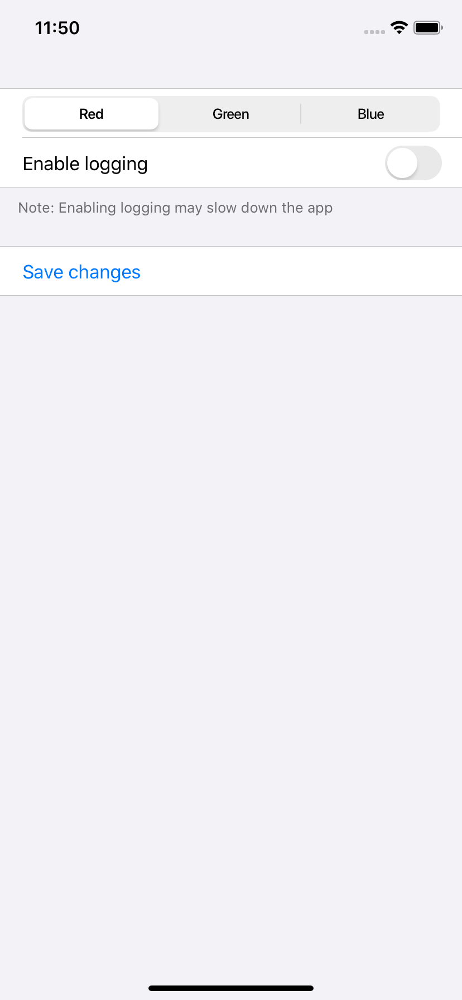

# 6.3 将表单分为几个sections

SwiftUI 的表单通常在分成多个部分时效果最好，就像常规的内容列表一样。 你如何将它们分组取决于你，但是当你按照它们的目的进行分组通常最有效 - 如果它是一个订单页面你可以将项目放在一个组中，在另一个组中定制，在第三组中交付。

很有帮助的是，表单 sections 与列表 sections 相同，这意味着您可以在两个地方重复使用相同的代码。因此，您可以向 sections 中添加页眉和/或页脚，或者两者都不使用，只需在 sections 之间获得一些屏幕上的间距。

例如，这将创建一个包含两个`section`的表单，第一个`section`带有分段的控件和切换，第二个`section`带有保存按钮:

```swift
struct ContentView : View {
    
    @State var enableLogging = false
    @State var selectedColor = 0
    @State var colors = ["Red", "Green", "Blue"]
    
    var body: some View {
        Form {
            Section(footer: Text("Note: Enabling logging may slow down the app")) {
                SegmentedControl(selection: $selectedColor) {
                    ForEach(0..<colors.count) {
                        Text(self.colors[$0]).tag($0)
                    }
                }
                Toggle(isOn: $enableLogging) {
                    Text("Enable logging")
                }
            }
            Section {
                Button(action: {
                    
                }) {
                    Text("Save changes")
                }
            }
        }
        .navigationBarTitle(Text("Settings"))
    }
}
```



[Breaking forms into sections](https://www.hackingwithswift.com/quick-start/swiftui/breaking-forms-into-sections)

