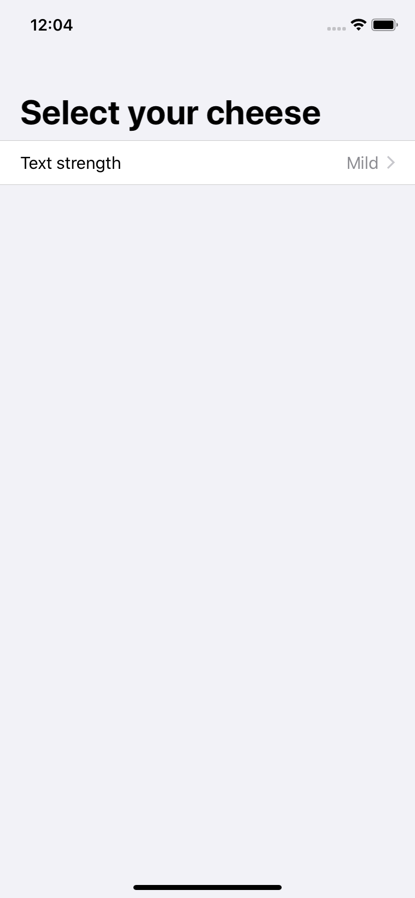
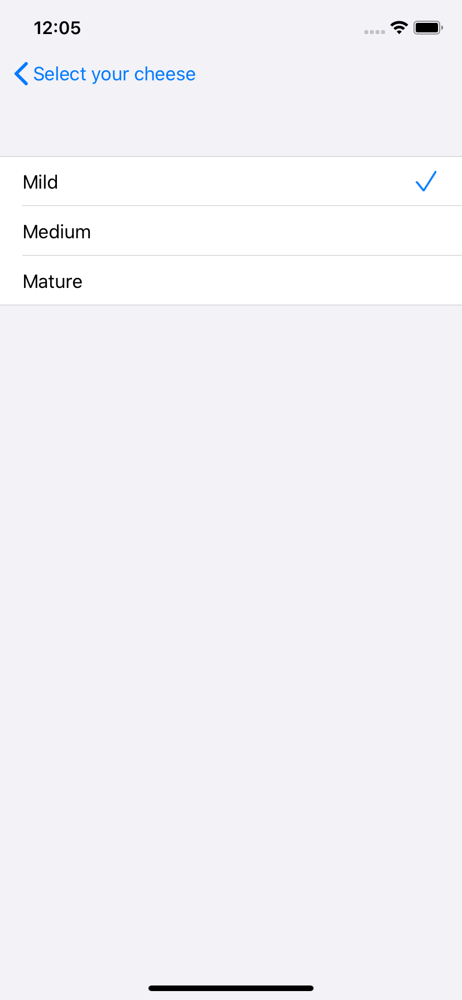
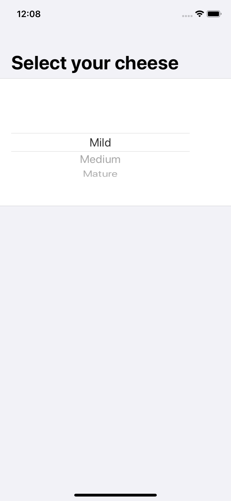

# 6.4 表单中的 Pickers

`SwiftUI` 的 **选择器视图** 在表单内部时具有特殊的行为，可根据您使用它们的平台自动进行调整。这种行为尤其令人印象深刻，因为选择器可以折叠到一个列表行，该行导航到一个新的可能选项列表中——这是处理许多选项的一种非常自然的方式。

例如，这将创建一个带有选择器的表单，并为其项使用数组：

```swift
struct ContentView : View {
    
    var strengths = ["Mild", "Medium", "Mature"]
    @State var selectedStrength = 0
    
    var body: some View {
        NavigationView {
            Form {
                Section {
                    Picker(selection: $selectedStrength, label: Text("Text strength")) {
                        ForEach(0..<strengths.count) {
                            Text(self.strengths[$0]).tag($0)
                        }
                    }
                }
            }
            .navigationBarTitle(Text("Select your cheese"))
        }
    }
}
```



在iOS上，这将显示为一个单独的列表行，您可以点击该行进入一个新屏幕，显示所有可能的选项—— `Mild`、`Medium`和`Mature`。您当前的选择旁边将有一个复选标记，当您选择一个新选项时，它将返回上一个屏幕，并显示当前的选项。



如果要禁用此行为，可以使用`.PickerStyle(.wheel)`修饰符强制选取器采用其常规样式，如下所示：

```swift
Picker(selection: $selectedStrength, label: Text("Text strength")) {
    ForEach(0..<strengths.count) {
        Text(self.strengths[$0]).tag($0)
    }
}
.pickerStyle(.wheel)
```



[Pickers in forms](https://www.hackingwithswift.com/quick-start/swiftui/pickers-in-forms)

