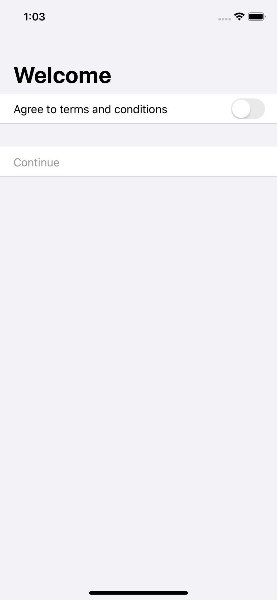
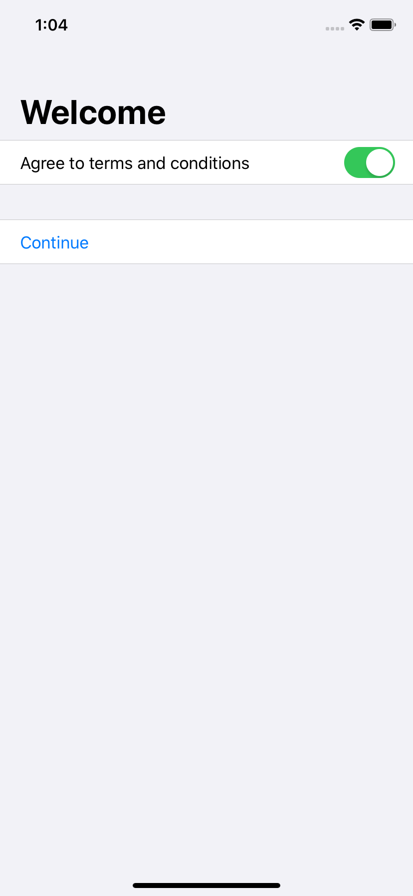

# 6.5 启用和禁用表单中的元素

`SwiftUI` 允许我们通过使用**`disabled()`**修饰符来禁用表单的任何部分甚至整个表单。这需要一个布尔值来定义是否应禁止使用该元素。表单元素的样式会自动更新以反映其状态-例如，buttons 和 toggles 为灰色。

例如，这将创建一个包含两个sections 的表单：一个section 包含 `Toggle` ，另一个部分包含仅在切换打开时才启用的 `Button`：

```swift
struct ContentView : View {
    
    @State var agreedToTerms = false
    
    var body: some View {
        NavigationView {
            Form {
                Section {
                    Toggle(isOn: $agreedToTerms) {
                        Text("Agree to terms and conditions")
                    }
                }
                Section {
                    Button(action: {
                        // show next screen here
                    }) {
                        Text("Continue")
                    }
                    .disabled(!agreedToTerms)
                }
            }
            .navigationBarTitle(Text("Welcome"))
        }
    }
}
```

如您所见，只需将禁用`（!agreeToTerms）`添加到修改器列表中即可禁用该按钮。

与许多其他SwiftIUI修饰符一样，您可以提升`disabled()`，以便它在`Section`上运行，甚至在整个表单上运行，这取决于您想要的行为——例如，只需移动`disabled(!agreedToTerms)`使它位于该部分之后。





[Enabling and disabling elements in forms](https://www.hackingwithswift.com/quick-start/swiftui/enabling-and-disabling-elements-in-forms)

